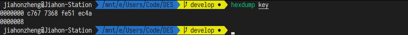

# 实验报告

> 数据科学与计算机学院 2017 级软件工程教务 2 班 16305204 郑佳豪

## 算法原理概述

DES 算法是一种常见的分组加密算法，其实现过程大致分为 4 个步骤：

+ 初始置换
+ 生成子密钥
+ 16 轮迭代
+ 逆置换

### 初始置换

**初始置换**是将原始明文 $M$（64 位）经过 IP 置换表处理，得到 64 位的数据 $M'$。IP 置换表存储着置换信息，如 $58$ 表示将 $M$ 的第 58 位放置到第 $1$ 位。

```c++
// 初始置换
const char IP[] = {58, 50, 42, 34, 26, 18, 10, 2,  60, 52, 44, 36, 28,
                   20, 12, 4,  62, 54, 46, 38, 30, 22, 14, 6,  64, 56,
                   48, 40, 32, 24, 16, 8,  57, 49, 41, 33, 25, 17, 9,
                   1,  59, 51, 43, 35, 27, 19, 11, 3,  61, 53, 45, 37,
                   29, 21, 13, 5,  63, 55, 47, 39, 31, 23, 15, 7};
```

在代码实现中，我们实现了 `do_permutation` 函数用于对数据进行**置换**操作。

```c++
// 置换
// 对 in 位的 data 数据根据 perm 置换出 out 位数据
uint64_t do_permutation(const char* perm, int in, int out, uint64_t data) {
  uint64_t ret = 0;
  for (int i = 0; i < out; i++) {
    ret = (ret << 1) | ((data >> (in - perm[i])) & 1);
  }
  return ret;
}
```

### 生成子密钥

DES 加密共执行16次迭代，每次迭代过程的数据长度为 48 位，因此我们需要生成 16 个 48 位的子密钥。首先，我们将 $K$ 根据 PC1 置换表进行置换，变成 56 位密钥，PC1 置换表如下。

```c++
// PC-1 置换
const char PC1[] = {57, 49, 41, 33, 25, 17, 9,  1,  58, 50, 42, 34, 26, 18,
                    10, 2,  59, 51, 43, 35, 27, 19, 11, 3,  60, 52, 44, 36,
                    63, 55, 47, 39, 31, 23, 15, 7,  62, 54, 46, 38, 30, 22,
                    14, 6,  61, 53, 45, 37, 29, 21, 13, 5,  28, 20, 12, 4};
```

我们对 `PC1` 置换得到的 56 位密钥，分为前 28 位 $C_0$ 和后 28 位 $D_0$ ，分别对其进行**循环左移**，得到 $C_1$ 和 $D_1$ 。其中，每轮移动位数如下。

```c++
// 移动位数
// 第 1 轮移动 1 位
// 第 2 轮移动 1 位
// 第 3 轮移动 2 位
// ......
// 第 16 轮移动 1 位
const char iteration_shift[] = {1, 1, 2, 2, 2, 2, 2, 2, 1, 2, 2, 2, 2, 2, 2, 1};
```

我们将 $C_1$ 和 $D_1$ 合并为 56 位，根据 PC2 进行置换，得到当前这一轮的 48 位子密钥 $K_1$ 。

```c++
// PC-2 置换
const char PC2[] = {14, 17, 11, 24, 1,  5,  3,  28, 15, 6,  21, 10,
                    23, 19, 12, 4,  26, 8,  16, 7,  27, 20, 13, 2,
                    41, 52, 31, 37, 47, 55, 30, 40, 51, 45, 33, 48,
                    44, 49, 39, 56, 34, 53, 46, 42, 50, 36, 29, 32};
```

随后，我们总共重复上述流程 16 轮，最终得到 16 个 48 位子密钥。在实现中，我们生成子密钥的具体代码如下。

```c++
// 计算子密钥
void calc_subkeys(uint64_t key, uint64_t* subkeys) {
  // 进行 PC1 置换
  uint64_t permuted_choice_1 = do_permutation(PC1, 64, 56, key);
  uint32_t C = (uint32_t)((permuted_choice_1 >> 28) & 0xFFFFFFF);
  uint32_t D = (uint32_t)(permuted_choice_1 & 0xFFFFFFF);
  for (int i = 0; i < 16; ++i) {
    // 循环左移
    for (int j = 0; j < iteration_shift[i]; ++j) {
      C = (0x0fffffff & (C << 1)) | (0x00000001 & (C >> 27));
      D = (0x0fffffff & (D << 1)) | (0x00000001 & (D >> 27));
    }
    // 合并 C 和 D 得到 56 位数据
    uint64_t permuted_choice_2 = (((uint64_t)C) << 28) | (uint64_t)D;
    subkeys[i] = 0;
    // 进行 PC2 置换
    for (int j = 0; j < 48; ++j) {
      subkeys[i] =
          (subkeys[i] << 1) | ((permuted_choice_2 >> (56 - PC2[j])) & 1);
    }
  }
}
```

### 16 轮迭代

我们对初始置换得到的 $M'$ ，划分为前 32 位 $L_0$ 和后 32 位 $R_0$ ，我们需要对其进行 Feistel 轮函数置换。Feistel 函数接收两个输入（32 位的数据、48 位的子密钥），输出 32 位的数据。

我们对输入的 32 位数据根据 E 扩展置换，扩展为 48 位，具体代码如下。

```c++
// 进行 E 扩展置换
uint64_t sbox_input = do_permutation(E, 32, 48, R);
```

其中的 E 置换表如下。

```c++
// E-扩展置换
const char E[] = {32, 1,  2,  3,  4,  5,  4,  5,  6,  7,  8,  9,
                  8,  9,  10, 11, 12, 13, 12, 13, 14, 15, 16, 17,
                  16, 17, 18, 19, 20, 21, 20, 21, 22, 23, 24, 25,
                  24, 25, 26, 27, 28, 29, 28, 29, 30, 31, 32, 1};
```

我们将扩展后的 48 位数据与 48 位子密钥进行**异或**运算，具体代码如下。

```c++
// 将扩展后的 48 位数据与 48 位子密钥进行异或运算
if (mode == DECRYPT_MODE) {
  sbox_input ^= subkeys[15 - i];
} else {
  sbox_input ^= subkeys[i];
}
```

随后，我们对异或运算得到的 48 位数据，进行 S-盒替换 。

```c++
// 进行 S-盒替代
uint64_t sbox_output = calc_sbox(sbox_input);
```

在 S-盒替换 中，我们将 48 位数据划分成 8 个 6 位的块，每个块通过一个对应的 S 盒产生 4 位的输出，其具体代码如下。

```c++
// 进行 S-盒替代
uint64_t calc_sbox(uint64_t data) {
  uint64_t ret = 0;
  for (int i = 0; i < 8; ++i) {
    // 计算 S 表对应的行
    uint8_t row =
        (uint8_t)((data & (0x0000840000000000 >> (6 * i))) >> (42 - 6 * i));
    row = (row >> 4) | (row & 1);
    // 计算 S 表对应的列
    uint8_t column =
        (uint8_t)((data & (0x0000780000000000 >> (6 * i))) >> (43 - 6 * i));
    // 对于每个 6 位的块，通过 S 表产生 4 位的输出
    // 将 8 个 4 位输出合并为 32 位数据
    ret = (ret << 4) | (uint32_t)(S[i][16 * row + column] & 0xF);
  }
  return ret;
}
```

在完成 S-盒替代 后，我们需要对 32 位输出，进行 P-盒置换，得到 32 位数据。

```c++
// 进行 P 盒置换
uint64_t feistel_ret = do_permutation(P, 32, 32, sbox_output);
```

上述过程，即为 Feistel 轮函数的计算过程。在每进行一轮 Feistel 计算后，我们需要根据以下规则计算下一轮需要的 $L$ 和 $R$ 。

$$
L_i = R_{i-1}  \\
R_i = L_{i-1} \oplus Feistel(R_{i-1}, K_i)
$$


```c++
// 计算下一轮所需要的 L 和 R
uint32_t temp = R;
R = L ^ feistel_ret;
L = temp;
```

### 逆置换

在进行 16 轮迭代过程后，我们需要对 $L$ 和 $R$ 进行互换，并进行 PI 逆置换。

最后，我们将上述的**初始置换**、**生成子密钥**、**迭代过程**和**逆置换**四部分整合，即可得到 `des_block` 的具体实现。

```c++
// 对 64 位数据进行 DES 加密或解密
uint64_t des_block(uint64_t chunk, uint64_t* subkeys, int mode) {
  // 进行初始置换
  uint64_t init_perm_res = do_permutation(IP, 64, 64, chunk);
  // 获取初始的 L
  uint32_t L = (uint32_t)(init_perm_res >> 32) & L64_MASK;
  // 获取初始的 R
  uint32_t R = (uint32_t)init_perm_res & L64_MASK;
  // 进行 16 轮迭代
  for (int i = 0; i < 16; ++i) {
    // 进行 Feistel 函数计算
    // 进行 E 扩展置换
    uint64_t sbox_input = do_permutation(E, 32, 48, R);
    // 将扩展后的 48 位数据与 48 位子密钥进行异或运算
    if (mode == DECRYPT_MODE) {
      sbox_input ^= subkeys[15 - i];
    } else {
      sbox_input ^= subkeys[i];
    }
    // 进行 S-盒替代
    uint64_t sbox_output = calc_sbox(sbox_input);
    // 进行 P 盒置换
    uint64_t feistel_ret = do_permutation(P, 32, 32, sbox_output);
    // 计算下一轮所需要的 L 和 R
    uint32_t temp = R;
    R = L ^ feistel_ret;
    L = temp;
  }
  // 交换 L 和 R
  uint64_t pre_output = (((uint64_t)R) << 32) | (uint64_t)L;
  // 进行逆置换
  uint64_t ret = do_permutation(PI, 64, 64, pre_output);
  return ret;
}
```

### 字节填充与截断

根据 PKCS#5 (RFC 8018) 规范，我们需要对原始明文信息进行**字节填充**：

+ 原始明文消息最后的分组不够 8 个字节时，在末尾以字节填满，填入的字节取值相同，都是填充的字节数目。
+ 原始明文消息刚好分组完全时，在末尾填充 8 个字节，每个字节取值都是 08 。

由于我们对原始明文信息进行字节填充，则我们对密文信息进行解密时，得进行**字节截断**。

+ 我们读取密文解密后的最后分组的最后一个字节，读取其值，即加密时填充的字节数目，我们将此数目作为截断的字节数目。

在程序实现中，我们实现了 `des` 函数来对文件进行**加密**和**解密**，其中的字节填充和字节截断的处理代码如下。

```c++
uint64_t subkeys[16] = {0};
// 计算 16 个 48 位子密钥
calc_subkeys(key, subkeys);
char read_chunk[8];
char write_chunk[8];
size_t read_chunk_len;
while ((read_chunk_len = fread(read_chunk, sizeof(uint8_t), 8, input_file))) {
  // 每读取 8 个字节，对 input_len 进行更新，其初始值为输入文件的大小
  input_len -= read_chunk_len;
  // 对每 64 位数据进行加密或解密
  _des(mode, subkeys, read_chunk, write_chunk, output_file);
  // 加密时，最后分组的字节填充
  if (mode == ENCRYPT_MODE && input_len < 8) {
    fread(read_chunk, sizeof(uint8_t), 8, input_file);
    // 填充 input_len 个字节
    for (int i = input_len; i < 8; i++) {
      read_chunk[i] = input_len;
    }
    _des(ENCRYPT_MODE, subkeys, read_chunk, write_chunk, output_file);
    break;
  }
  // 解密时，最后分组的字节截断
  if (mode == DECRYPT_MODE && input_len == 8) {
    fread(read_chunk, sizeof(uint8_t), 8, input_file);
    uint64_t ret = des_block(to_uint64(read_chunk), subkeys, DECRYPT_MODE);
    int times = ret & 0x7;
    to_bit(ret, write_chunk);
    // 截断 times 个字节
    fwrite(write_chunk, sizeof(uint8_t), times, output_file);
    break;
  }
}
```

## 总体结构

我们使用**自顶向下**的模式设计本程序。首先，我们需要明确程序的设计需求：**生成密钥**、**加密文件**、**解密文件**。由于在 DES 算法中，加密和解密的过程并无太大差异，所以我们将**加密文件**和**解密文件**用一个模块来实现。因此，我们需要实现 2 个模块，分别用于**生成密钥**和**文件加解密**。

除此之外，由于我们希望在命令行下使用该程序，我们还应该设计一个**用户接口模块**，提供命令行操作。

## 模块分解

经过上述分析，我们需要设计 2 个模块：**密钥生成** 和 **文件加解密** ，现在我们具体对这两个模块进行分析。

对于**密钥生成模块**，由于此模块功能单一（随机数生成、位运算），我们使用一个函数即可将其实现（位于 `des.c` 中的 `generate_des_key` 函数）。

对于**文件加解密模块**，我们可以划分为几个小模块。第一个模块是对 64 位数据进行处理的 `des_block` 模块，第二个模块是对文件进行分组加解密的模块（依赖于 `des_block` 模块）。由于在这些模块以及**密钥生成模块**中，都涉及到位运算的操作，故我们将位运算操作封装为一个**工具模块**（`bits.h`）。由于 DES 算法需要各种置换表，且为了使得模块代码变得精简，我们将各种置换表封装为**数据模块**（`tables.h`）。

最后，我们的项目文件目录如下。

```
include
	bits.h 		位运算模块 头文件
	des.h		文件加解密模块和生成密钥模块 头文件
	tables.h	数据模块 头文件
src
	bits.c		位运算模块 实现
	des.c		文件加解密模块和生成密钥模块 实现
	main.c		命令行接口模块 实现
	tables.c	数据模块 实现
Makefile
```

## 数据结构

在程序实现中，我们并未使用很高级的数据结构，用的最多的是 `tables.h` 中存储各个置换表的数组：**一维数组**、**二维数组**。

## C 语言源代码

程序源码请参照 `DES/` 目录。

## 编译运行结果

### 编译

在程序实现中，我使用了 Makefile 作为编译构建脚本，我们只需在命令行下执行以下命令，即可构建程序。

```bash
make
```

### 测试

在 Makefile 中，我添加了 test 功能，用于自动测试程序加密和解密的正确性，我们可在命令行下执行 `make test` 命令，进行程序的自动化测试。以下是 Makefile 中 test 的具体内容。

```makefile
test:
	@echo "Clean the previous binary build."
	@make clean

	@echo "\nBuild the new binary."
	@make

	@echo "\nGenerate a key."
	@./bin/des keygen key
	@echo "The hexdump of the key:"
	@hexdump key

	@echo "\nGenerate a plain file."
	@hexdump key > plain
	@echo "The hexdump of the plain file:"
	@hexdump plain

	@echo "\nEncrypt the plain file with the key."
	@./bin/des encrypt key plain encrypted
	@echo "The hexdump of the encrypted file:"
	@hexdump encrypted

	@echo "\nDecrypt the encrypted file with the key."
	@./bin/des decrypt key encrypted decrypted
	@echo "The hexdump of the decrypted file:"
	@hexdump decrypted

	@echo "\nThe difference between the plain file and the decrypted file:"
	@diff plain decrypted

	@echo "\nClean the testing files."
	@rm -f key plain encrypted decrypted
```

### 运行

#### 使用说明

我们若在命令行下直接执行 `./bin/des` ，则会显示程序的使用说明。


#### 生成密钥

通过执行下述命令，我们随机生成 DES 密钥。

```bash
./bin/des keygen key
```

我们通过执行 `hexdump key` 命令查看密钥的 16 位形式。



#### 加密文件

我们新建 `test.txt` 文件，其内容如下。


我们对该文件进行 DES 加密，将密文输出为 `encrypted` 文件，并查看密文内容。


#### 解密文件

随后，我们对 `encrypted` 文件进行解密为 `decrypted` 文件，并对比 `decrypted` 和 `test.txt` 的异同。


我们使用 `diff` 命令比对 `decrypted` 和 `test.txt` 的差异，结果发现无差异，说明程序的加密和解密功能是正常、准确的。

## 实验心得

在本次实验中，我学会了 DES 算法的原理，以及如何去实现 DES 算法。在实验过程中，遇到了一些问题：如何实现高效的置换函数、S-盒置换的行列计算、加密时的字符填充、解密时的字符截断等，但最终我都成功解决了。这些问题的解决，让我对位运算的使用更为熟悉，在成功实现一版程序后，我使用位运算实现很多关键部分的计算，虽然程序执行在目测上并未提速多少，但内心还是挺有成就感的。

总体来说，这次实验还是比较成功的，让我收获颇丰。